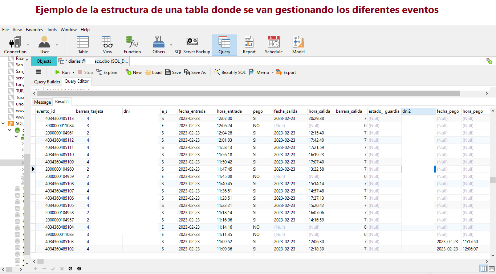

<h1 align="center">Servidor en Java</h1>

## Video

  

El sistema recibie solicitudes de diferentes aplicaciones y actúa como replicador entre una base de datos "SQL Server" y múltiples bases "Mysql" con la finalidad de gestionar transacciones en la plataforma de MercadoPago.

En el ejemplo de este código el paquete se encarga de gestionar transacciones de un sistema Ecommerce ligados a un identificador numérico que se corresponde a un número de ticket con el fin de validar su acceso si las solicitudes entran por esa vía.

La finalidad de este proyecto es realizar pagos Online mediante un sistema de tickets, la interfaz gráfica de pago se realiza medinte un módulo Web desarrollado en PHP.

<strong> Cabe aclarar que el paquete publicado en el repositorio es solo uno de los módulos, seleccionado para ejemplo.</strong>

## Video

